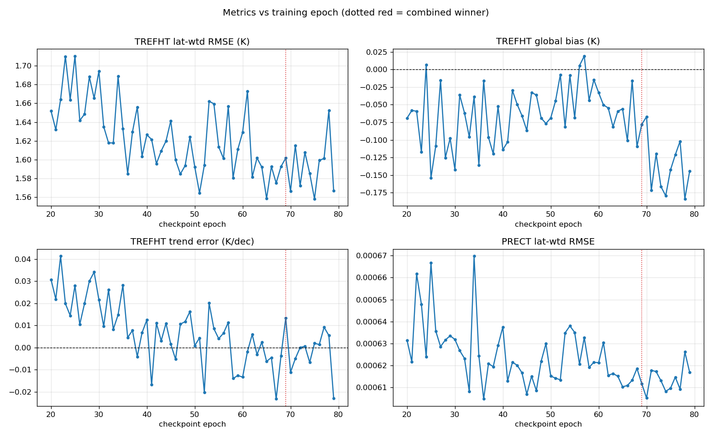
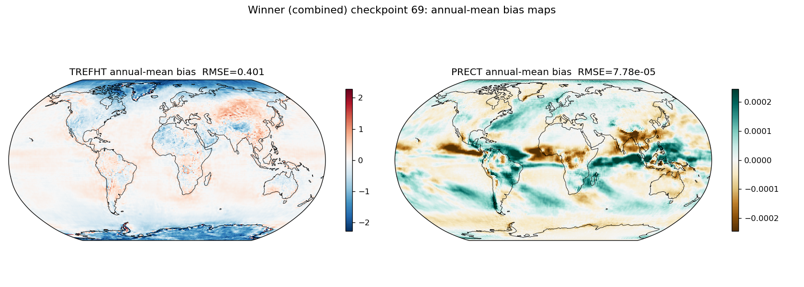

# CAMulator

CAMulator is an auto-regressive machine-learned emulator of NSF NCAR's CAM6
atmosphere, trained and run within the
[CREDIT](https://github.com/WillyChap/miles-credit) framework. Given prescribed
sea-surface temperature, sea-ice, incoming solar radiation, and CO2, it rolls a
1 degree (192x288), 32-level, 6-hourly atmospheric state forward for
climate-length simulations (years to decades). It conserves global dry-air mass,
moisture, and total atmospheric energy, remains numerically stable over decadal
rollouts, and reproduces the annual climatology together with major modes of
variability such as ENSO and the NAO -- at roughly a 350x speedup over CAM6,
making it an efficient way to generate large climate ensembles.

The model and method are described in Chapman et al. (2025), *CAMulator: Fast
Emulation of the Community Atmosphere Model*
([arXiv:2504.06007](https://arxiv.org/abs/2504.06007)).

CAMulator is a research tool. It emulates a specific CAM6 configuration and is
not a substitute for an operational forecast or a full Earth-system model.

### Quick links

- Inference toolbox (code): https://github.com/WillyChap/miles-credit (branch `camulator_huggingface`, dir `climate/`)
- CREDIT framework: https://github.com/NCAR/miles-credit
- Paper: Chapman et al. (2025), *CAMulator: Fast Emulation of the Community Atmosphere Model*, [arXiv:2504.06007](https://arxiv.org/abs/2504.06007)
- This model + data: https://huggingface.co/willychap/camulator

### Inference quickstart

```bash
# 1. get the toolbox
git clone -b camulator_huggingface https://github.com/WillyChap/miles-credit.git camulator
cd camulator

# 2. environment (PyTorch 2.4.1 + CUDA 12.1; pinned in environment.yml)
conda env create -f environment.yml -n camulator
conda activate camulator
pip install -e . --no-deps        # --no-deps: environment.yml pins the exact stack

# 3. pull this model + its inputs into ./assets/
cd climate
python download_assets.py --repo_id willychap/camulator     # default checkpoint = epoch 69

# 4. verify + run (writes monthly-mean NetCDF by default)
python check_setup.py
bash RunQuickClimate.sh
```

Full instructions, configuration, and the asset manifest are in
[`climate/README.md`](https://github.com/WillyChap/miles-credit/blob/camulator_huggingface/climate/README.md).

### Evaluation

We evaluate many training checkpoints by running each as a free-running,
autoregressive 35-year rollout (1980-2014, 6-hourly, no-leap) and scoring it
against the CREDIT ERA5-scaled training target on the same 1 degree grid
(latitude-weighted), looking at both the monthly-mean climatology and the
6-hourly distribution.

#### How the evaluation works

Training loss is a poor guide to whether an emulator will hold together for
decades, so we select checkpoints on *emulator behaviour*, not on validation
loss. Every candidate epoch gets the same treatment:

1. **Free-running rollout.** Each checkpoint runs the full 35 years
   autoregressively from a single 1 Jan 1980 initial condition, with prescribed
   SST/sea-ice/solar/CO2 forcing and the energy fixer active. Nothing is nudged
   or re-initialized: errors are free to accumulate for 51,100 steps.
2. **Score the monthly-mean climatology** against the training target for the two
   headline fields (TREFHT, PRECT): spatiotemporal RMSE, climatological RMSE,
   global-mean bias, global-mean monthly RMSE, decadal-trend error, and annual
   correlation. Every spatial average is cos(latitude)-weighted.
3. **Combine into one score.** Each metric is z-scored *across the checkpoints*
   (so metrics in kelvin and metres-per-6h can be added), then summed into
   `score_TREFHT` and `score_PRECT`; the combined score is their sum. **Lower is
   better.** A separate average-rank ranking is computed as an independent
   cross-check that the result is not an artefact of z-scoring.
4. **Break ties on the 6-hourly tails.** The top few checkpoints are then scored
   on how well they reproduce the *distribution tails* of PRECT and TREFHT —
   things a monthly mean cannot see (see the key below). The final choice blends
   the monthly and tail scores 50/50.

This matters because the ranking is not what a loss curve would suggest, and the
metrics disagree with each other — see the trade-off discussion below.

All evaluation rollouts are run with the global energy fixer **active**, matching
the constraint the model was trained under (see *Conservation at inference*
below).

**Checkpoint 69 is selected as the default.** The rest of the top ten by combined
score (epochs 36, 70, 66, 51, 47, 75, 52, 64, 65) are provided as well, so you can
evaluate them yourself, build cheap checkpoint ensembles, or study sensitivity to
training stage — pick one with
`download_assets.py --checkpoint checkpoint.pt000NN.pt`. Several checkpoints from
earlier selections (33, 43, 46, 48, 63, 68, 76) also remain hosted.

Checkpoint 69 climatology (latitude-weighted, full 35-yr record):

| Field | Spatiotemporal RMSE | Global-mean bias | Decadal-trend error | Global-mean monthly RMSE | Annual corr. |
|---|---|---|---|---|---|
| TREFHT | 1.602 K | -0.078 K | +0.013 K/decade | 0.160 K | 0.989 |
| PRECT  | 6.12e-4 (2.4 mm/day) | +3.2e-6 (+0.01 mm/day) | -- | clim. RMSE 7.78e-5 | -- |

#### Which checkpoint should you use?

Checkpoint 69 is the default because it ranks first on precipitation overall and
first on the blended monthly + 6-hourly score. On the monthly-mean climatology
alone it is effectively tied with checkpoint 36 (the two composite scores differ
by 1%, and the independent average-rank cross-check mildly prefers 36); the
6-hourly tails are what separate them, and there 69 wins decisively. But the
choice still encodes a weighting, and it is worth being explicit about the
trade-off, because **no single checkpoint wins everything**:

- **Precipitation.** Checkpoint 69 is the leader: it has the best composite PRECT
  score of all 60 checkpoints, its global-mean precipitation bias is small in
  absolute terms (+0.01 mm/day against a truth global mean of 2.93 mm/day, the
  5th smallest of the 60), and it has the lowest total error (bias-RMSE) on the
  6-hourly PRECT p99.9 / p99.99 heavy-rain tails. Checkpoint 70 edges it on the
  *spatial correlation* of those tails (0.971 vs 0.969 at p99.9), but by a margin
  far smaller than 69's advantage in magnitude.
- **Temperature.** This is where 69 gives something up. **Checkpoint 70 is the
  better temperature model**: it has a lower TREFHT RMSE (1.566 K vs 1.602 K) and
  wins 4 of 6 6-hourly TREFHT tail metrics on bias-RMSE — i.e. it gets the
  *spatial pattern* of temperature extremes right. If your application is
  temperature-driven, 70 is a defensible choice.
- **Global-mean tail bias.** Checkpoint 69 has a smaller global-mean bias than 70
  on *every* tail metric we score (11/11), sometimes by a large factor (e.g. the
  coldest-night TNn bias is +0.03 K for 69 vs +0.23 K for 70). 70's advantage on
  temperature is in the pattern, not the offset.
- **Checkpoint 36** is essentially tied with 69 on the monthly-mean climatology
  (combined score -8.86 vs -8.95) and is the single best checkpoint on **TREFHT
  alone**. It is not the default because its 6-hourly precipitation tails are by
  far the worst of the finalists — a failure the monthly means cannot see, and
  the clearest illustration of why the tail tiebreaker exists.
- **Checkpoint 65** (an earlier default) remains strong on TREFHT but falls to
  10th on the combined score.

**So: use 69 for general-purpose work and anything precipitation-driven; consider
70 if you are temperature-focused, or 36 if you want the best monthly-mean
temperature and do not care about rainfall extremes.** The default reflects a
50/50 blend of the monthly and 6-hourly scores with temperature and precipitation
weighted roughly equally; a different, equally defensible weighting would select
a different checkpoint.

#### What the selection actually looks like



This is the most informative view of the selection, and it is worth reading
carefully before you assume "later epoch = better model".

- **Skill improves with training, but noisily, and it saturates.** TREFHT RMSE
  falls from ~1.70 K in the low 20s to ~1.57 K by the mid-60s, but the
  epoch-to-epoch scatter (~0.05 K) is a large fraction of that total improvement.
  Adjacent epochs can differ by more than the trend does over ten epochs. This is
  why we evaluate a *population* of checkpoints rather than simply taking the last
  one, and why the improvement past ~epoch 60 is not meaningful.
- **The metrics disagree.** The epoch that minimizes TREFHT RMSE is not the one
  that minimizes global bias, nor the one that minimizes PRECT RMSE. There is no
  epoch that wins every panel — hence the combined z-score, and hence the
  trade-off discussion above.
- **Global temperature bias drifts cold with training.** Bias is scattered around
  -0.05 K through the 40s and 50s, then trends toward -0.15 K beyond epoch 70
  (mean -0.148 K for epochs >=71). Later is not better: the latest checkpoints are
  measurably colder, which is one reason the default sits at epoch 69 rather than
  at the end of training.
- **Trend error is small everywhere, and shrinks with training.** Every one of
  the 60 checkpoints has a decadal-trend error under 0.05 K/decade in magnitude
  (median +0.006). Early epochs run warm (mean +0.025 K/decade at epoch <=30) and
  this converges to roughly zero by epoch 60 (mean -0.003). This is the key
  stability result — these are free-running 35-year rollouts with no drift
  correction, so nothing prevents a trend error from growing except the model
  itself.

The remaining figures summarize the outcome: a skill scorecard across the top
checkpoints, checkpoint 69's annual-mean bias maps, the global-mean temperature
evolution against the training target, and the 6-hourly precipitation
distribution.





> Note on PRECT units: native values are metres of liquid-water equivalent per
> 6-hourly step (ERA5 `tp` convention); mm/day = native x 4000 (1000 mm/m x 4
> steps/day). Checkpoint 69's global-mean precipitation is 2.95 mm/day vs. truth
> 2.93.

#### Key: variables, metrics, and acronyms

**Variables**

| Name | Meaning |
|---|---|
| `TREFHT` | Reference-height (2 m) air temperature, in kelvin. The standard "surface air temperature". |
| `PRECT` | Total precipitation (convective + large-scale). Native units are metres of liquid-water equivalent per 6-hourly step; mm/day = native x 4000. |
| `GMT` | Global-mean temperature — the cos(latitude)-weighted spatial mean of `TREFHT`. |

**Tail / extremes metrics** (computed per grid point over the full 6-hourly
record, then aggregated)

| Name | Meaning |
|---|---|
| `p99`, `p99.9`, `p99.99` | The 99th / 99.9th / 99.99th percentile of the 6-hourly values at each grid point — the *hot* tail for TREFHT, the *heavy-rain* tail for PRECT. p99.99 of 6-hourly data is roughly a once-a-year event. |
| `p1`, `p0.1` | The 1st / 0.1st percentile — the *cold* tail of TREFHT. |
| `TXx` | Mean of the **annual maxima** of TREFHT — the typical hottest moment of a year ("T-max-max"). |
| `TNn` | Mean of the **annual minima** of TREFHT — the typical coldest moment of a year ("T-min-min"). |
| `Rx` | Mean of the **annual maximum** 6-hourly precipitation — the typical wettest 6 hours of a year. |
| `freq>~10mm/d` | Fraction of 6-hourly steps exceeding a ~10 mm/day rain rate — how *often* it rains hard, as opposed to how hard. |

`TXx`, `TNn`, and `Rx` follow the standard ETCCDI climate-extremes convention.

**Error measures**

| Name | Meaning |
|---|---|
| RMSE | Root-mean-square error vs the training target. All spatial averages are cos(latitude)-weighted, so grid cells are weighted by true area. |
| Global-mean bias | Model global mean minus truth global mean. Can be small even when the model is locally wrong, because errors of opposite sign cancel. |
| bias-RMSE | RMSE of the *map* of tail bias. Unlike global-mean bias, local errors cannot cancel. Related by RMSE² = bias² + (centred RMSE)², i.e. bias-RMSE already contains the global offset. |
| Centred RMSE | The part of the error left after removing the global-mean offset — i.e. how wrong the spatial *pattern* is, independent of any uniform shift. |
| Pattern correlation | Area-weighted spatial correlation between the model and truth maps: does the model put the extremes in the right *places*? |
| Trend error | Model minus truth linear trend in global-mean TREFHT over the record, in K/decade. Near zero means the free-running rollout is not drifting. |
| z-score | A metric re-expressed as standard deviations from the mean *across the evaluated checkpoints*. Lets metrics with different units be summed into one score. It is relative: a good z-score means "better than the other checkpoints", not "good in absolute terms". |

### Conservation at inference

CAMulator is trained with a global **energy fixer** (an up/down rescaling of the
temperature field that closes the column energy budget against the prescribed
TOA and surface fluxes). This constraint is **active at inference** and is
enabled in the shipped `inference_config.yaml`; running without it is a
train/inference mismatch.

Enabling it costs a little accuracy relative to running unconstrained — it makes
global-mean precipitation ~2% wetter, because rescaling temperature changes
saturation vapour pressure and so perturbs precipitation indirectly — but it is
the constraint the model was trained under, it is stable over 35-year rollouts
(no drift, no NaN), and it is what makes the energy budget physically meaningful.
All numbers and figures on this card are produced with the fixer active.

### Repository layout

```
willychap/camulator
├── README.md                          # this model card
├── inference_config.yaml              # ready-to-run config (= camulator_config.yml)
├── checkpoint.pt00069.pt              # default model (epoch 69); other top epochs alongside
├── forcing_data/
│   ├── b.e21.CREDIT_climate_cyclic_1yr_f32coords.nc      # cyclic (default)
│   └── b.e21.CREDIT_climate_branch_1980_2014.nc          # progressive/transient
├── initial_conditions/
│   └── init_camulator_condition_tensor_*.pth            # 69 ICs (Jan 1 & Jul 1, 1980/1981-2014)
├── normalization/
│   ├── mean_*.nc, std_*.nc                               # z-score
│   └── *statics*.nc                                      # statics + latitude weights
├── metadata/
│   └── camulator_metadata.yaml                           # output variable units / long-names
└── figs/                                                 # model-card figures
```

(The inference toolbox actually reads its units from the in-repo copy
`climate/camulator_metadata.yaml`; the `metadata/` copy here is for reference.)

`download_assets.py` pulls these into the toolbox's `./assets/` for you.

### Training data

CAMulator was trained on a CAM6 / ERA5-scaled climate dataset (1980-2014). The
full training archive is not hosted here; the inputs needed to *run* the model
(forcing, initial conditions, normalization, statics) are.

If you would like access to our training Zarr datasets, please email
wchapman [at] colorado.edu.

### Citation

```bibtex
@article{chapman2025camulator,
  title   = {CAMulator: Fast Emulation of the Community Atmosphere Model},
  author  = {Chapman, William E. and Schreck, John S. and Sha, Yingkai and
             Gagne II, David John and Kimpara, Dhamma and Zanna, Laure and
             Mayer, Kirsten J. and Berner, Judith},
  journal = {arXiv preprint arXiv:2504.06007},
  year    = {2025},
  doi     = {10.48550/arXiv.2504.06007},
  url     = {https://arxiv.org/abs/2504.06007}
}
```
