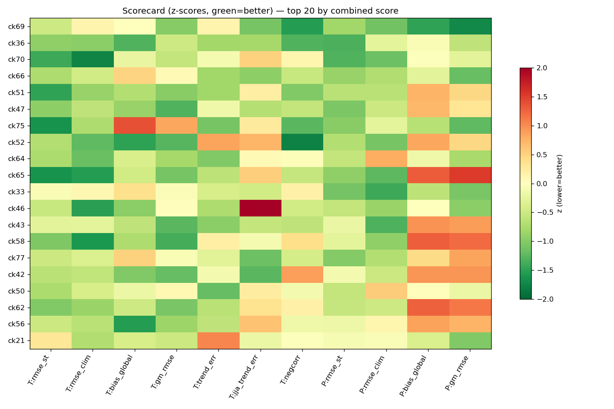
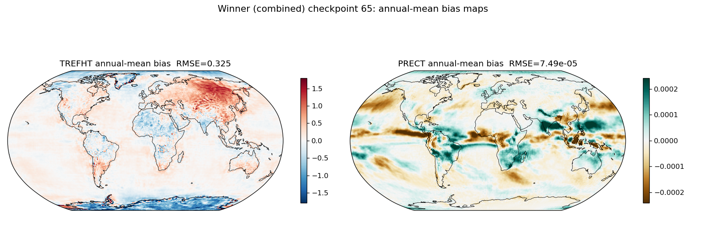
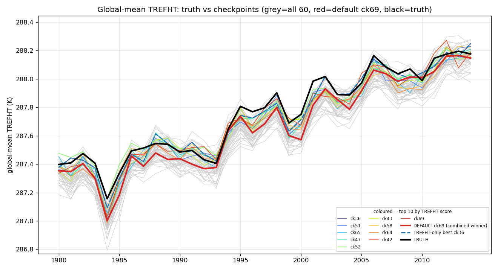
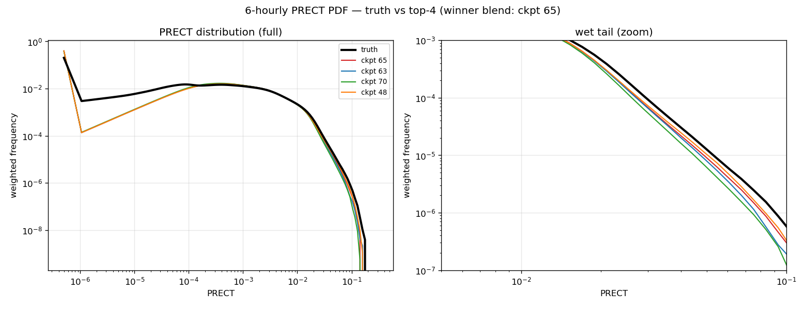

# CAMulator

**CAMulator** is an auto-regressive machine-learned emulator of NSF NCAR's CAM6
atmosphere, trained and run within the
[CREDIT](https://github.com/WillyChap/miles-credit) framework. Given prescribed
sea-surface temperature, sea-ice, incoming solar radiation, and CO2, it rolls a
1 degree (192x288), 32-level, 6-hourly atmospheric state forward for
climate-length simulations (years to decades). It conserves global dry-air mass,
moisture, and total atmospheric energy, remains numerically stable over decadal
rollouts, and reproduces the annual climatology together with major modes of
variability such as ENSO and the NAO -- at roughly a **350x speedup over CAM6**,
making it an efficient way to generate large climate ensembles.

The model and method are described in Chapman et al. (2025), *CAMulator: Fast
Emulation of the Community Atmosphere Model*
([arXiv:2504.06007](https://arxiv.org/abs/2504.06007)).

CAMulator is a research tool. It emulates a specific CAM6 configuration and is
not a substitute for an operational forecast or a full Earth-system model.

### Quick links

- Inference toolbox (code): https://github.com/WillyChap/miles-credit (branch `camulator_huggingface`, dir `climate/`)
- CREDIT framework: https://github.com/NCAR/miles-credit
- Paper: Chapman et al. (2025), *CAMulator: Fast Emulation of the Community Atmosphere Model*, [arXiv:2504.06007](https://arxiv.org/abs/2504.06007)
- This model + data: https://huggingface.co/willychap/camulator

### Inference quickstart

```bash
# 1. get the toolbox
git clone -b camulator_huggingface https://github.com/WillyChap/miles-credit.git camulator
cd camulator

# 2. environment (PyTorch 2.4.1 + CUDA 12.1; pinned in environment.yml)
conda env create -f environment.yml -n camulator
conda activate camulator
pip install -e . --no-deps        # --no-deps: environment.yml pins the exact stack

# 3. pull this model + its inputs into ./assets/
cd climate
python download_assets.py --repo_id willychap/camulator     # default checkpoint = epoch 65

# 4. verify + run (writes monthly-mean NetCDF by default)
python check_setup.py
bash RunQuickClimate.sh
```

Full instructions, configuration, and the asset manifest are in
[`climate/README.md`](https://github.com/WillyChap/miles-credit/blob/camulator_huggingface/climate/README.md).

### Evaluation

The default checkpoint (**epoch 65**) was chosen by a two-stage,
observation-anchored evaluation. Each of 60 candidate checkpoints (epochs 20-79)
was run as a free-running, autoregressive 35-year rollout (1980-2014, 6-hourly,
no-leap) from a 1 January 1980 initial state and scored against the CREDIT
ERA5-scaled training target on the identical 1 degree grid. All statistics are
latitude-weighted.

**Stage 1 - climatological skill (monthly means).** Twelve metrics per field
(bias, pattern RMSE, interannual correlation, decadal-trend fidelity, drift) for
2 m temperature (TREFHT) and total precipitation (PRECT). Checkpoint 65 wins the
combined score, wins precipitation outright, and wins an independent average-rank
cross-check.



**Checkpoint 65 climatology (latitude-weighted, full 35-yr record):**

| Field | Spatiotemporal RMSE | Global-mean bias | Decadal-trend error | Global-mean monthly RMSE | Annual corr. |
|---|---|---|---|---|---|
| TREFHT | 1.564 K | +0.033 K | -0.007 K/decade | 0.159 K | 0.985 |
| PRECT  | 6.09e-4 (2.4 mm/day) | -3.9e-6 (essentially neutral) | -- | clim. RMSE 7.49e-5 | -- |

Annual-mean spatial bias is small and coherent (TREFHT RMSE 0.325 K, largest at
high-latitude land and sea-ice margins; PRECT RMSE 7.49e-5, modest tropical
structure with no large-scale offset):



The global-mean warming trend and interannual variability are reproduced
(decadal-trend error -0.007 K/decade, annual correlation 0.985):



**Stage 2 - extremes tiebreaker (6-hourly).** The top four checkpoints were
compared on the distribution tails of 6-hourly TREFHT and PRECT. Temperature
extremes are a statistical tie across the finalists; the heavy-precipitation tail
is decisive, and checkpoint 65 tracks the truth wet tail most closely.



A 50/50 blend of the monthly and extremes scores selects **checkpoint 65** as the
only candidate strong on both timescales (checkpoint 63 is the temperature-leaning
runner-up). Other epochs are hosted too, so you can study sensitivity to training
stage; pick one with `download_assets.py --checkpoint checkpoint.pt000NN.pt`.

> Note on PRECT units: native values are metres of liquid-water equivalent per
> 6-hourly step (ERA5 `tp` convention); mm/day = native x 4000. Checkpoint 65's
> global-mean precipitation is 2.92 mm/day vs. truth 2.93.

### Repository layout

```
willychap/camulator
├── README.md                          # this model card
├── inference_config.yaml              # ready-to-run config (= camulator_config.yml)
├── checkpoint.pt00065.pt              # default model (epoch 65); other epochs alongside
├── forcing_data/
│   ├── b.e21.CREDIT_climate_cyclic_1yr_f32coords.nc      # cyclic (default)
│   └── b.e21.CREDIT_climate_branch_1980_2014.nc          # progressive/transient
├── initial_conditions/
│   └── init_camulator_condition_tensor_*.pth                 # 69 ICs (Jan 1 & Jul 1, 1980/1981-2014)
├── normalization/
│   ├── mean_*.nc, std_*.nc                                # z-score
│   └── *statics*.nc                                       # statics + latitude weights
└── figs/                                                  # model-card figures
```

(Output variable units/long-names ship with the inference toolbox as
`climate/camulator_metadata.yaml`, so they are version-controlled with the code
rather than hosted as a data asset.)

`download_assets.py` pulls these into the toolbox's `./assets/` for you.

### Training data

CAMulator was trained on a CAM6 / ERA5-scaled climate dataset (1980-2014). The
full training archive is not hosted here; the inputs needed to *run* the model
(forcing, initial conditions, normalization, statics) are.

If you would like access to our training Zarr datasets, please email
**wchapman [at] colorado.edu**.

### Citation

```bibtex
@article{chapman2025camulator,
  title   = {CAMulator: Fast Emulation of the Community Atmosphere Model},
  author  = {Chapman, William E. and Schreck, John S. and Sha, Yingkai and
             Gagne II, David John and Kimpara, Dhamma and Zanna, Laure and
             Mayer, Kirsten J. and Berner, Judith},
  journal = {arXiv preprint arXiv:2504.06007},
  year    = {2025},
  doi     = {10.48550/arXiv.2504.06007},
  url     = {https://arxiv.org/abs/2504.06007}
}
```
